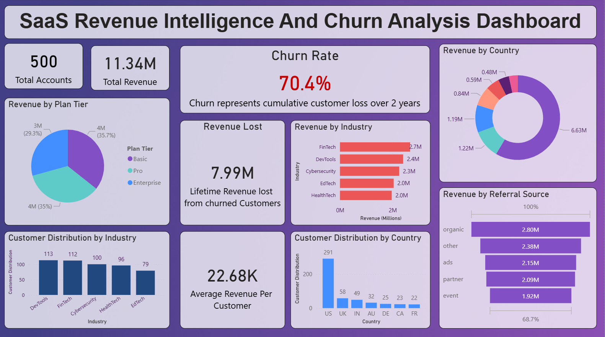
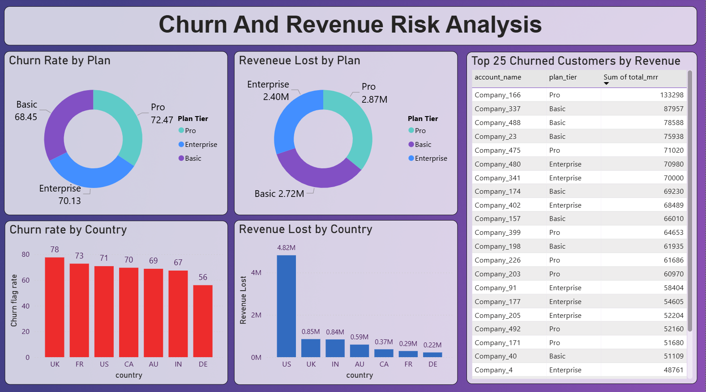

# 📊 SaaS Revenue Intelligence And Churn Risk Analysis

## 🚀 Project Overview

This project analyzes a SaaS company’s customer and subscription data to evaluate **revenue performance, churn behavior, and business risk**.

The objective is to move beyond simple reporting and identify:

- Key drivers of customer churn  
- Revenue impact of churned customers  
- High-risk customer segments  
- Actionable strategies to improve retention  

---

## 🧠 Business Context

SaaS businesses depend on recurring revenue, making **customer retention a critical success factor**.

This project focuses on key SaaS metrics:

- **Churn Rate** – Percentage of customers lost  
- **MRR (Monthly Recurring Revenue)**  
- **ARPU (Average Revenue Per User)**  
- **Revenue Lost due to Churn**  
- **Customer Segmentation (Plan, Country, Industry)**  

---

## 📂 Dataset Description

The analysis is based on the **Ravenstack SaaS dataset**, which includes:

- 500 customer accounts  
- 5000+ subscription records  
- Feature usage data  
- Support ticket logs  
- Churn event data  

Multiple datasets were combined to create a unified **account-level KPI model**.

---

## 🛠️ Data Processing & Modeling

### Data Preparation
- Cleaned and validated multiple datasets  
- Converted date columns and handled missing values  
- Identified multi-subscription behavior per account  

### Feature Engineering
Built an `account_kpi` dataset with:

- Revenue Metrics → `total_mrr`, `total_arr`, `avg_mrr`  
- Customer Lifetime → `active_days`  
- Usage Metrics → `total_usage`, `avg_usage`  
- Support Metrics → `total_tickets`, response times  
- Churn Indicator → `churn_flag`  

---

## 📊 Key Metrics

- **Total Accounts:** 500  
- **Total Revenue:** ~11.34M  
- **Churn Rate:** ~70.4% *(cumulative over 24 months)*  
- **Revenue Lost:** ~7.99M  
- **ARPU:** ~22.68K  

---

## 🔍 Key Insights

- 🔴 **High Revenue Risk:**  
  ~70% of total revenue is linked to churned customers, indicating churn impacts high-value accounts.

- 📉 **Plan-Level Analysis:**  
  - Pro plan has the highest churn and highest revenue loss  
  - Basic plan contributes the most revenue with relatively lower churn  

- 🌍 **Geographic Insights:**  
  - US contributes the majority of revenue  
  - UK shows the highest churn rate  

- ⚠️ **Behavior Analysis:**  
  - No single dominant factor (usage or support tickets) explains churn  
  - Indicates a **systemic retention issue** rather than isolated problems  

---

## 📈 Dashboard Overview

### 🔹 Page 1 – Executive Overview
- Total Accounts, Revenue, Churn Rate, ARPU  
- Revenue distribution by plan, country, and industry  

### 🔹 Page 2 – Churn & Revenue Risk Analysis
- Churn by plan and country  
- Revenue loss segmentation  
- Top revenue-losing churned customers  

---

## 🧠 Business Recommendations

- Improve retention strategies for the **Pro plan** (pricing, features, onboarding)  
- Strengthen **customer success and support systems**  
- Focus on retention in **high-revenue regions (US, UK)**  
- Enhance product engagement to reduce systemic churn  

---

## 🧰 Tools & Technologies

- **Python (Pandas, NumPy)** → Data cleaning & analysis  
- **SQL (Analytical queries)** → Aggregation & segmentation logic  
- **Power BI** → Dashboard development  
- **Excel** → Data validation & quick analysis  

---

## 📷 Dashboard Preview

### Executive Overview


### Churn & Risk Analysis


---

## 📌 Project Structure
```
saas-revenue-intelligence/ 
│
├── data/
│ ├── account_kpi.csv
│ └── raw_datasets/
│
├── notebooks/
│ └── saas_analysis.ipynb
│
├── dashboard/
│ └── saas_dashboard.pbix
│
├── images/
│ ├── dashboard_page1.png
│ └── dashboard_page2.png
│
└── README.md
```


---

## 💡 Key Learning

> Data analysis is not just about creating dashboards, but about identifying business problems, validating them with data, and delivering actionable insights.

---
